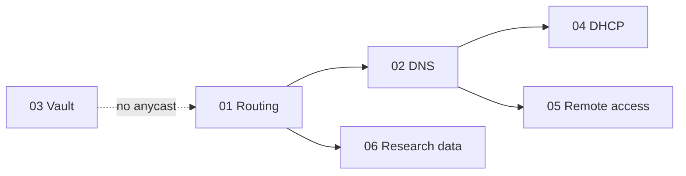

# Hybrid platform ADRs

These ADRs cover Vault, DNS, DHCP, remote access, and research-data movement across two on-prem data centres and AWS.

*Researched 24–26 Sep 2026. Prices are AWS list prices and change over time. Re-check them before quoting.*

## Constraints

1. **Survive the loss of one data centre or one provider** (including AWS as a whole).
2. **Pivot to AWS**, but research storage stays on-prem.
3. **Service continuity:** minimal downtime during migration.
4. Explainable in a 3-page doc and a 10-minute talk.

## Decisions

| ADR | Topic | Decision | Status | Cost / trade-off |
|---|---|---|---|---|
| [01](01-hybrid-routing.md) | Hybrid routing and anycast failover | TGW Connect for AWS nodes · conditional `/24` across DX · static allowed prefixes + S2S VPN backup · FRR + health checker on every node | Accepted (daemon: Proposed) | BGP and GRE on EC2; prefix-list discipline |
| [02](02-dns.md) | DNS resolution | Two anycast IPs in separate node groups · Route 53 hybrid for AWS · PowerDNS Recursor | Accepted (Route 53 role: Proposed) | Six nodes; two DNS systems |
| [03](03-vault.md) | Secrets (Vault) | Enterprise: AWS primary (5 nodes, 3 AZs), on-prem performance secondary, DR Region | Accepted | Licence cost |
| [04](04-dhcp.md) | DHCP | Kea HA hot-standby DC1 ↔ DC2; no DHCP in AWS | Accepted | Doesn't "move to AWS", by design |
| [05](05-remote-access.md) | Remote access | AWS Client VPN + on-prem OpenVPN fallback | Accepted | Connection-hour cost; single Region |
| [06](06-research-data.md) | Research data path | Public VIF to S3, stage then compute | Accepted | A governed copy of data in AWS |

## Reading an ADR

Each record contains:

- **Context:** the facts and constraints behind the choice.
- **Decision:** the selected approach and its status.
- **Options considered:** the chosen option (✓), the main alternative, and one additional comparison.
- **Consequences:** what improves (`+`), what it costs or complicates (`-`), and any follow-up work.
- **Well-Architected:** the relevant best-practice IDs.
- **Sources.**

## Diagrams

The diagrams in `diagrams/` are `.drawio.svg` files: they render in Markdown and open in draw.io for editing. Their file names and titles still use the **old numbering**:

| Old doc | Diagram prefix | Now in |
|---|---|---|
| 01 route injection, 02 DX advertisement, 03 return path, 04 health checking, 05 BGP daemon | `01-` … `05-` | [ADR-01](01-hybrid-routing.md) |
| 06 resolver software, 07 service IP count, 08 Route 53 role | `06-` … `08-` | [ADR-02](02-dns.md) |
| 09 Vault | `09-` | [ADR-03](03-vault.md) |
| 10 DHCP | `10-` | [ADR-04](04-dhcp.md) |
| 11 remote access | `11-` | [ADR-05](05-remote-access.md) |
| 12 bulk data path, 13 training locality | `12-`, `13-` | [ADR-06](06-research-data.md) |

## Well-Architected

Each ADR lists the best-practice IDs it touches, from the six pillars (OPS, SEC, REL, PERF, COST, SUS) and from these lenses: **Hybrid Networking** (HNREL…), **Data Residency and Hybrid Cloud**, and **Machine Learning** (MLCOST…).

- [Framework](https://docs.aws.amazon.com/wellarchitected/latest/framework/welcome.html) · [Hybrid Networking Lens](https://docs.aws.amazon.com/wellarchitected/latest/hybrid-networking-lens/) · [Data Residency and Hybrid Cloud Lens](https://docs.aws.amazon.com/wellarchitected/latest/data-residency-hybrid-cloud-services-lens/data-residency-with-hybrid-cloud-services-lens.html) · [Machine Learning Lens](https://docs.aws.amazon.com/wellarchitected/latest/machine-learning-lens/best-practices-by-pillar.html)
