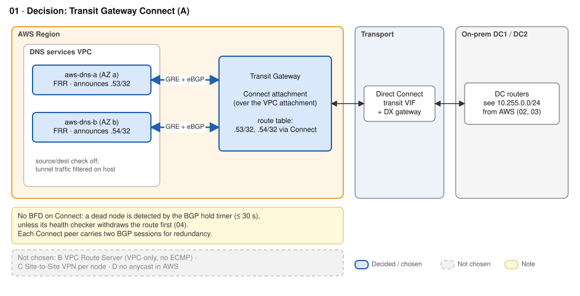
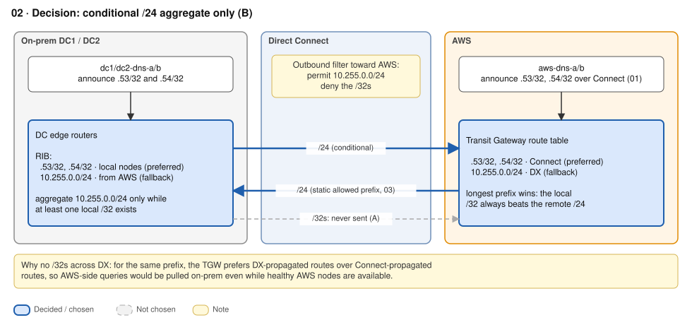
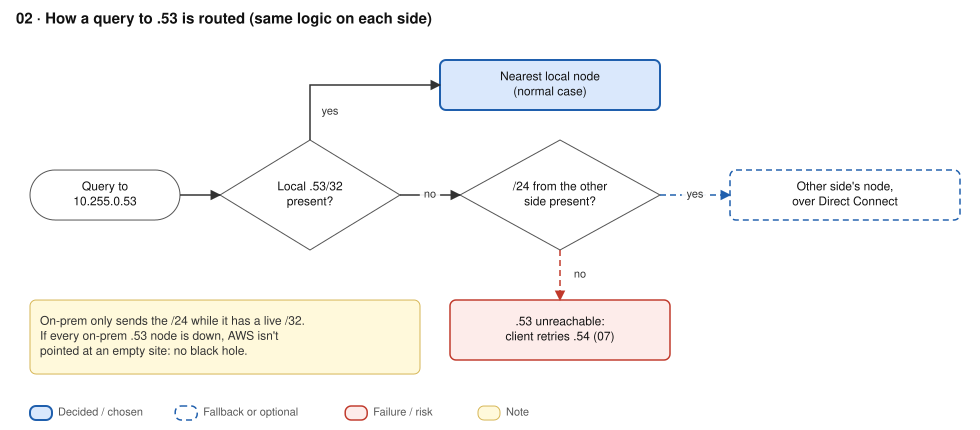
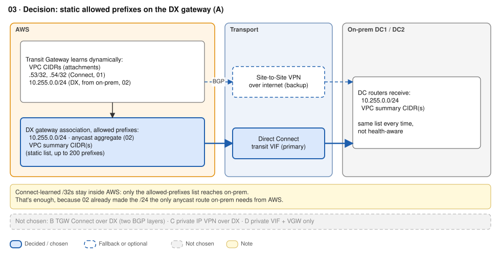
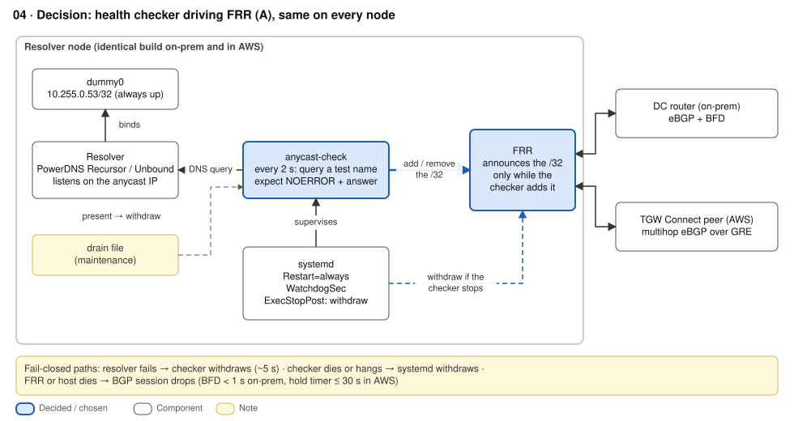
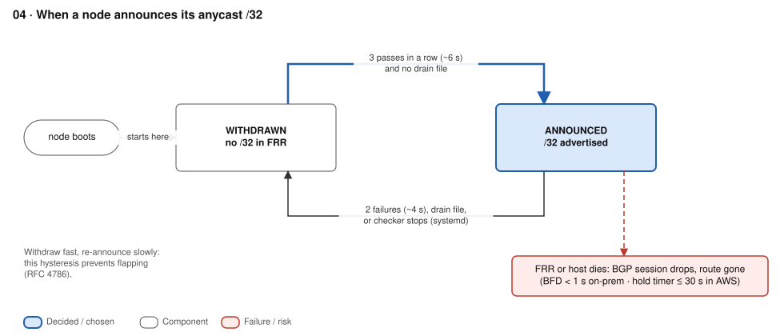
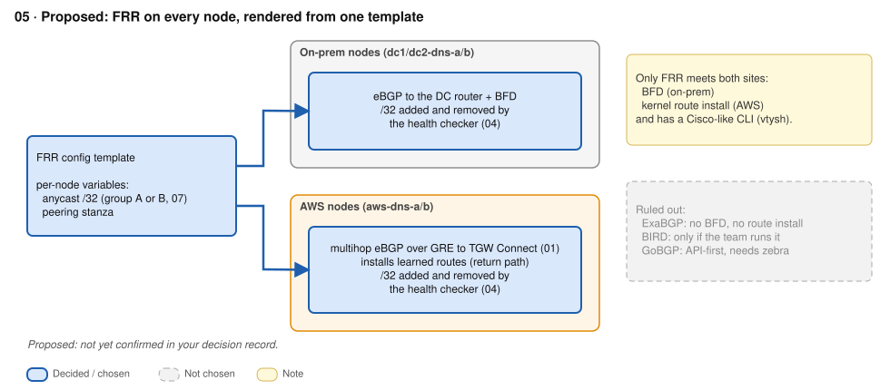

# ADR-01 · Hybrid routing and anycast failover

**Status:** Accepted, except D4 (Proposed) · **Date:** 2026-09-26 · **Replaces:** old 01–05

## Context

- On-prem, each DNS node announces its anycast `/32` to the DC routers over BGP. **EC2 can't speak BGP to the VPC router**, so AWS needs another way to accept the announcement.
- Two AWS routing rules drive every choice below:
  1. **TGW route priority:** for the same prefix, the TGW prefers routes from the **DX gateway over routes from Connect peers**, whatever the BGP attributes say.
  2. **DX gateway allowed prefixes:** on-prem only receives the static allowed-prefix list. Routes the TGW learns dynamically (for example `/32`s from Connect peers) are **not** passed on.
- A node must stop attracting traffic when its **service** fails, not only when BGP dies (RFC 4786 §4.4.1).
- Constraints: survive one DC or provider loss · nearest healthy node · no black holes or loops.

## Decision

| # | Question | Decision | Status |
|---|---|---|---|
| D1 | How do AWS nodes announce the anycast `/32`? | **TGW Connect** (GRE + BGP). Two nodes in two AZs | Accepted |
| D2 | What crosses DX from on-prem? | **Conditional `/24` aggregate only.** `/32`s never cross DX | Accepted |
| D3 | What does AWS advertise back to on-prem? | **Static allowed prefixes** on a transit VIF. **Site-to-Site VPN** over the internet as backup | Accepted |
| D4 | BGP daemon on the nodes | **FRR** on every node, one config template | Proposed |
| D5 | What ties service health to the route? | **`anycast-check`** (systemd) drives FRR, fail-closed. **BFD** to the DC routers | Accepted |

### How it behaves

| Situation | Path |
|---|---|
| Normal, on-prem client | Local `/32` beats AWS's `/24` → nearest DC node |
| Normal, AWS workload | Connect `/32` is the only `/32` in the TGW (on-prem never sends `/32`s, so rule 1 never fires) → AWS node |
| All on-prem nodes down | On-prem aggregate withdrawn → on-prem follows AWS's static `/24` over DX → TGW → Connect `/32` → AWS node |
| An IP down on both sides | TGW has no route → dropped, no loop. Clients retry the other IP ([ADR-02](02-dns.md)) |









### Node build (same template everywhere)

```
dummy0          10.255.0.53/32 (group A) or .54 (group B), always configured
Resolver        listens on the anycast IP (ADR-02)
anycast-check   systemd, every 2 s: query a local test name on the anycast IP,
                require NOERROR + expected answer
                2 failures → withdraw · 3 passes → announce · drain file → withdraw
FRR             announces the /32 only while anycast-check has added it
                on-prem: eBGP + BFD to the DC router
                AWS: multihop eBGP over GRE to TGW Connect, installs learned routes
```

- The saved FRR config never contains the `network` statement, so a node **boots withdrawn**.
- **Fail-closed:** `Restart=always`, `WatchdogSec=` and `ExecStopPost=` (runs the withdraw). If FRR dies, the BGP session drops and the route goes with it.
- **Health-check rules:** check the local service only (a shared upstream in the check would withdraw every node at once) · withdraw fast, re-announce slowly · drain before maintenance · alert on every change and on "N of M nodes withdrawn".

| Failure | Detected by | Time | Result |
|---|---|---|---|
| Resolver hangs | anycast-check | ~5 s | `/32` withdrawn, clients reach the next node of that group |
| Checker crashes | systemd | seconds | `/32` withdrawn |
| FRR or on-prem host dies | BFD | < 1 s | `/32` withdrawn |
| AWS node dies | Connect BGP hold timer (no BFD) | ≤ 30 s | `/32` withdrawn |
| Bad change breaks a whole group | anycast-check | ~5 s | That IP is gone everywhere; clients use the other IP |







## Options considered

**D1 · Route injection in AWS**

| Option | + | - |
|---|---|---|
| **TGW Connect** ✓ | True anycast; ECMP across AZs; 5 Gbps per peer; no fee beyond the VPC attachment's | No BFD (30 s hold timer); GRE and BGP on EC2; security groups only see the GRE header; needs a TGW CIDR block |
| No anycast in AWS | Simplest AWS side; normal security groups | Client-timeout failover (glibc waits 5 s); two models to run. See [ADR-02](02-dns.md) option C |
| VPC Route Server | Managed BGP with BFD | One best route (no ECMP); only updates VPC route tables; ~$1,100/month for two endpoints |

**D2 · What crosses DX**

| Option | + | - |
|---|---|---|
| **Conditional `/24` aggregate** ✓ | Locality by design (`/32` beats `/24`); automatic fallback; no loops | Prefix-lists must be right; one aggregate covers both groups (see follow-ups) |
| `/32`s both ways | Conceptually simple | Rule 1: AWS queries get pulled on-prem. Communities and prepends don't fix it |
| Nothing | Total isolation | No fallback if every on-prem node fails |

**D3 · AWS → on-prem**

| Option | + | - |
|---|---|---|
| **Static allowed prefixes + S2S VPN backup** ✓ | Simple, deterministic; VPN is a separate failure domain | Not health-aware; 200-prefix quota; changes are control-plane operations |
| TGW Connect over DX (on-prem routers) | Fully dynamic; 5,000 routes | Two BGP layers; 5 Gbps per tunnel; harder troubleshooting |
| Private IP VPN over DX | Dynamic plus IPsec | 1.25 Gbps per tunnel. For encryption alone, MACsec is simpler |

**D4 · BGP daemon**

| Option | + | - |
|---|---|---|
| **FRR** ✓ | Only option with BFD, kernel route install and multihop eBGP; Cisco-like CLI | Heavier than needed; frequent releases to patch |
| BIRD | Light; powerful filters | Own config language, less familiar |
| ExaBGP | Excellent announce and healthcheck module | No BFD and no kernel route install, so it can't serve either site |

**D5 · Health to route**

| Option | + | - |
|---|---|---|
| **Checker driving FRR** ✓ | One BGP daemon per node; BFD kept | Your own code; fail-closed must be built and tested |
| ExaBGP healthcheck | Fail-closed by design | A second BGP speaker next to FRR; no BFD |
| BGP session liveness only | Nothing to build | A hung resolver keeps attracting traffic: the RFC 4786 black hole |

## Consequences


- `+` One anycast model for the data centres and AWS. Sites answer locally; routing handles failover rather than clients.
- `+` A node flap stays local because only the aggregate crosses DX.
- `-` The AWS `/24` is static. If every AWS node is down, on-prem sends traffic to a TGW that drops it; clients see timeouts.
- `-` AWS node failures can take up to 30 seconds because Connect has no BFD. The checker should normally withdraw first.
- `-` AWS nodes need a host firewall because security groups cannot inspect inside GRE, and source/destination checks must be disabled.

**Follow-ups**
- **Per-group aggregates (open).** The single `/24` stays up while *any* on-prem `/32` exists. If group A fails on-prem but group B is alive, on-prem drops `.53` instead of falling back to AWS. Fix: one conditional aggregate per group, e.g. `10.255.0.52/31` (contains `.53`) and `10.255.0.54/31` (contains `.54`), both in the allowed prefixes. The TGW still prefers the Connect `/32` over the DX `/31`, because the longer prefix wins.
- Alert if any `/32` from `10.255.0.0/24` ever appears on a DX BGP session.
- Keep prefix-lists and aggregates in version control, tested in a pipeline.
- Game days: DX down → VPN takes over; kill the resolver, the checker and FRR on a node, and watch the route go each time.
- MACsec on dedicated DX ports if data classification requires link encryption.

## Well-Architected

REL02-BP02 redundant hybrid connectivity · HNREL04-BP03 dynamic routing for failover · REL11-BP02 fail over to healthy resources · REL11-BP05 static stability · REL11-BP04 don't edit allowed prefixes during recovery · REL12-BP05 game days · SEC05-BP02 traffic control (host firewall inside GRE) · OPS05-BP02 test changes · OPS06-BP03 drain before change.

## Sources

- [TGW Connect](https://docs.aws.amazon.com/vpc/latest/tgw/tgw-connect.html) · [How transit gateways work: route evaluation order](https://docs.aws.amazon.com/vpc/latest/tgw/how-transit-gateways-work.html) · [TGW quotas](https://docs.aws.amazon.com/vpc/latest/tgw/transit-gateway-quotas.html)
- [DX gateway allowed prefixes](https://docs.aws.amazon.com/directconnect/latest/UserGuide/allowed-to-prefixes.html) · [DX quotas](https://docs.aws.amazon.com/directconnect/latest/UserGuide/limits.html) · [DX routing and BGP communities](https://docs.aws.amazon.com/directconnect/latest/UserGuide/routing-and-bgp.html)
- [Overlay tunnel failover times on DX (AWS blog)](https://aws.amazon.com/blogs/networking-and-content-delivery/best-practices-to-optimize-failover-times-for-overlay-tunnels-on-aws-direct-connect/) · [VPC Route Server](https://docs.aws.amazon.com/vpc/latest/userguide/route-server-how-it-works.html)
- [RFC 4786: Operation of Anycast Services](https://www.rfc-editor.org/rfc/rfc4786.html) · [FRR BGP](https://docs.frrouting.org/en/latest/bgp.html) · [FRR BFD](https://docs.frrouting.org/en/latest/bfd.html) · [systemd.service](https://www.freedesktop.org/software/systemd/man/latest/systemd.service.html)
- [MACsec in Direct Connect](https://docs.aws.amazon.com/directconnect/latest/UserGuide/MACsec.html) · [AWS VPN pricing](https://aws.amazon.com/vpn/pricing/)
