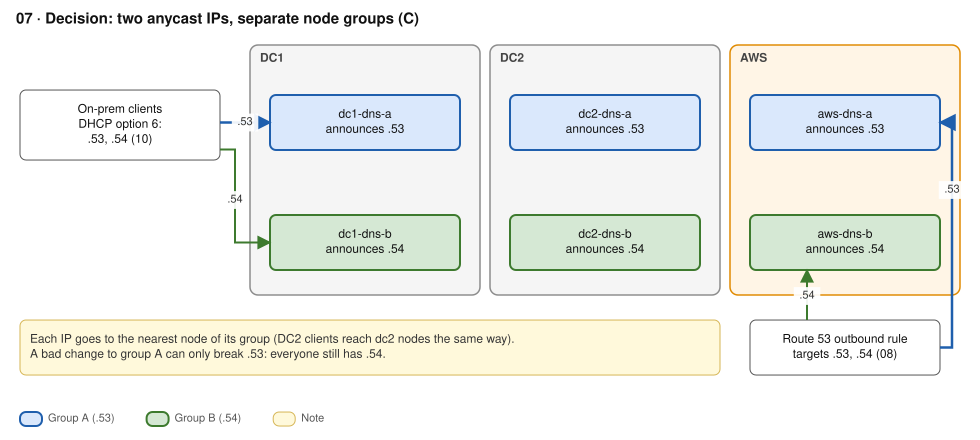
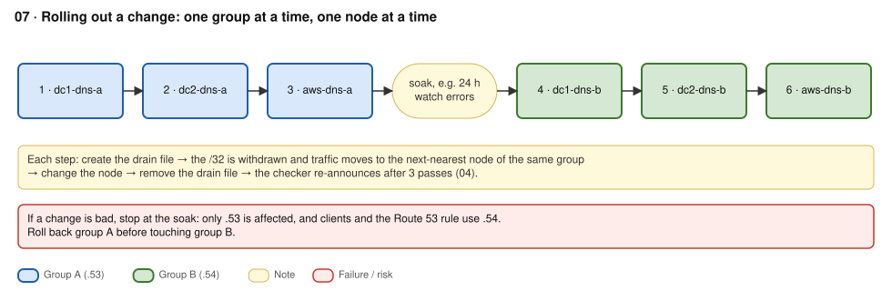
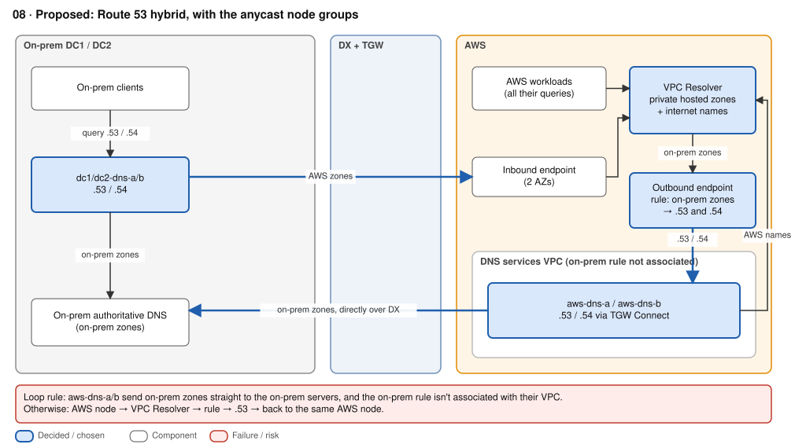
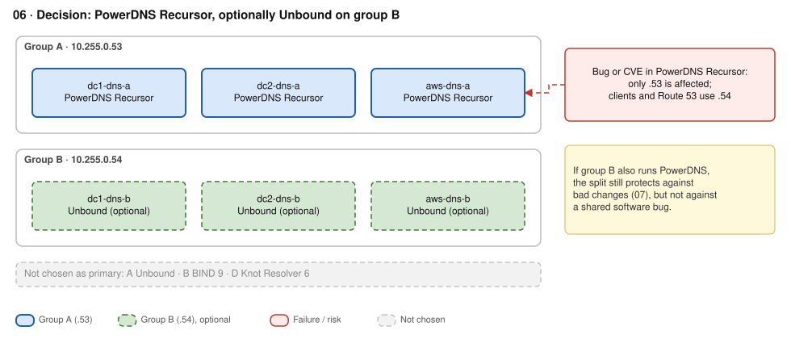

# ADR-02 · DNS resolution

**Status:** D1 Accepted · D2 Proposed · D3 Accepted (group B software open) · **Date:** 2026-09-26 · **Replaces:** old 06–08

## Context

- DNS is short and stateless, so it's the one service where anycast fits. Routing and health checks are in [ADR-01](01-hybrid-routing.md).
- Anycast protects against node and site failure, **not against failures that hit every node at once**: a bad config push, a shared CVE, or a prefix filtered by mistake.
- There are two kinds of consumer. **On-prem clients** get resolvers via DHCP option 6 ([ADR-04](04-dhcp.md)). **AWS workloads** use the VPC Resolver (`AmazonProvidedDNS`) and never see the anycast IPs directly.
- Route 53 facts that constrain the design: Resolver endpoints **can't be anycast** and live in **one Region**; there are **no zone transfers**; a resolver rule wins over a private hosted zone for the same domain; the control plane is in us-east-1.
- Constraints: on-prem keeps resolving if AWS or DX fails · pivot to AWS · safe rollouts.

## Decision

| # | Question | Decision | Status |
|---|---|---|---|
| D1 | How many service IPs? | **Two anycast IPs, separate node groups:** group A `10.255.0.53`, group B `10.255.0.54`. One node per group in DC1, DC2 and AWS (6 nodes) | Accepted |
| D2 | What does Route 53 own? | **Hybrid.** Route 53 serves AWS (VPC Resolver, private hosted zones, inbound and outbound endpoints). Anycast serves on-prem. The outbound rule for on-prem zones targets **both** IPs | Proposed |
| D3 | Resolver software | **PowerDNS Recursor** on group A. Group B: PowerDNS or **Unbound** for software diversity (open) | Accepted |

### How it works in practice

| Site | Group A (`.53`) | Group B (`.54`) | Peers with |
|---|---|---|---|
| DC1 | dc1-dns-a | dc1-dns-b | DC1 routers (eBGP + BFD) |
| DC2 | dc2-dns-a | dc2-dns-b | DC2 routers (eBGP + BFD) |
| AWS | aws-dns-a (AZ a) | aws-dns-b (AZ b) | TGW Connect |

| Node | AWS names | On-prem names | Internet names |
|---|---|---|---|
| On-prem nodes | Forward to the **inbound endpoint** | On-prem authoritative servers | Recurse |
| AWS nodes | Their own **VPC Resolver** | On-prem authoritative servers, directly over DX | VPC Resolver, or recurse |

**Rules**
1. **No forwarding loop.** Don't associate the on-prem outbound rule with the DNS VPC. AWS nodes send on-prem zones straight to the on-prem servers.
2. **Both IPs in the outbound rule.** Route 53 picks a target at random and retries another, so a broken group costs a retry, not an outage.
3. **The inbound endpoint is shared by both groups.** Give it IPs in 2+ AZs, and keep it out of the node health check.
4. **Records as code.** Route 53 has no AXFR, so one Git repo (e.g. octoDNS) feeds Route 53 and the on-prem authoritative servers.
5. **Don't edit records during recovery.** Fail over with health checks and pre-provisioned records (the control plane is in us-east-1).

**Rollout:** one group at a time, one node at a time, drain first ([ADR-01](01-hybrid-routing.md) D5). Soak (e.g. 24 h), then the other group. A bad change can only break one IP.

**Clients:** set `options timeout:1 attempts:2` (or the systemd-resolved equivalent) where you control the client, so a dead IP costs 1 s, not 5 s.

## Options considered

**D1 · Service IPs**

| Option | + | - |
|---|---|---|
| **Two IPs, separate groups** ✓ | Survives a bad push, a CVE or a prefix error; every change has a blast radius of half the fleet; same shape as public resolvers and Route 53 Global Resolver | 6 nodes; a dead IP costs a client timeout |
| One IP | Simplest | A bad change is instantly global: a configuration single point of failure |
| Two IPs on the same nodes | Protects against a filtered prefix | A crash or CVE hits both IPs at once |

**D2 · Route 53's role**

| Option | + | - |
|---|---|---|
| **Hybrid** ✓ | Each side resolves its own names when DX or AWS is down; the AWS side stays managed | Two DNS systems; records sync is your job; loop rule to enforce |
| Route 53 for everything (on-prem uses inbound endpoints) | Least to run | **Fails the provider-failure rule**: on-prem can't resolve anything when AWS or DX is down. ~10k QPS per endpoint IP |
| Route 53-only AWS side (no AWS anycast nodes) | No BGP or GRE on EC2; no loop risk; nothing to patch in AWS | No AWS last resort for on-prem clients; AWS lookups of on-prem names cross DX |

**If the Route 53-only AWS side is chosen** (also the fallback if the team won't run BGP on EC2, [ADR-01](01-hybrid-routing.md) D1):
- Anycast becomes on-prem only (4 nodes). The outbound rule can then be shared with every VPC, because there's no loop risk.
- Advertise the `/32`s to AWS and drop `10.255.0.0/24` from the allowed prefixes. With no Connect peers, TGW route priority no longer matters.
- On-prem nodes must forward to the inbound endpoint from their **unicast** IP. If they use the anycast IP, the reply can land on a different node.

**D3 · Resolver software**

| Option | + | - |
|---|---|---|
| **PowerDNS Recursor** ✓ | Lua hooks; built-in metrics and API; predictable release train | Major release about every 6 months; Lua needs governance |
| Unbound | Lean, simple config, strong DNSSEC | 10-CVE batch in May 2026; metrics need an exporter |
| BIND 9.20 | Reference implementation; familiar | Recursive and authoritative in one daemon (larger attack surface). **9.18 reached EOL in June 2026**: migrate if it's in use |

## Consequences

- `+` On-prem and AWS each resolve their own names through a DX or AWS outage. Only cross-side names fail, and those services are unreachable anyway.
- `+` A bad change or an implementation-specific bug is limited to one IP when group B uses Unbound.
- `-` Six resolver nodes need patching, plus inbound and outbound endpoints (about $365/month for four ENIs).
- `-` Each AWS group has one node. Losing its AZ sends that group's AWS traffic on-prem over DX.
- `-` Resolver-rule and private-hosted-zone namespaces cannot overlap.
- **Remote users:** Route 53 Global Resolver (managed anycast, DoH/DoT) is the better fit there. See [ADR-05](05-remote-access.md).

## Well-Architected

REL10-BP03 bulkheads (two groups) · REL11-BP05 static stability · REL11-BP04 data plane over control plane · OPS06-BP03 safe deployments · OPS05-BP01 records as code · SEC06-BP01 vulnerability management (patch one group first) · SEC01-BP05 reduce scope (recursive-only daemons).

## Sources

- [resolv.conf(5): timeout and attempts](https://man7.org/linux/man-pages/man5/resolv.conf.5.html) · [RFC 4786](https://www.rfc-editor.org/rfc/rfc4786.html) · [B-Root software diversity](https://b.root-servers.org/news/2021/02/18/bind-and-knot.html)
- [Route 53 Resolver quotas](https://docs.aws.amazon.com/Route53/latest/DeveloperGuide/DNSLimitations.html) · [Outbound forwarding: random target and retry](https://docs.aws.amazon.com/Route53/latest/DeveloperGuide/resolver-forwarding-outbound-queries.html) · [PHZ considerations](https://docs.aws.amazon.com/Route53/latest/DeveloperGuide/hosted-zone-private-considerations.html) · [Hybrid DNS reference architecture](https://docs.aws.amazon.com/reference-architecture-diagrams/latest/hybrid-dns-route53/hybrid-dns-dualstack.html)
- [Route 53 Global Resolver](https://docs.aws.amazon.com/Route53/latest/DeveloperGuide/gr-what-is-global-resolver.html) · [Fault isolation: Route 53 control plane](https://docs.aws.amazon.com/whitepapers/latest/aws-fault-isolation-boundaries/appendix-b---edge-network-global-service-guidance.html) · [octoDNS](https://github.com/octodns/octodns)
- [PowerDNS Recursor release policy](https://docs.powerdns.com/recursor/appendices/EOL.html) · [Unbound CVEs](https://stack.watch/product/nlnetlabs/unbound/) · [BIND 9.18 EOL](https://www.isc.org/blogs/2026-06-10-bind9-18-eol/)
