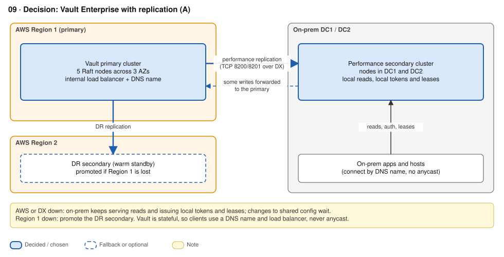

# ADR-03 · Secrets management (Vault)

**Status:** Accepted · **Date:** 2026-09-26 · **Replaces:** old 09

## Context

- Vault is **stateful**: only the active node writes. Anycast is the wrong tool (RFC 7094). HA comes from Raft plus a load balancer and DNS.
- HashiCorp guidance: **5 Raft nodes across 3 AZs**, < 8 ms between nodes, **never one cluster across Regions or sites**. Multi-site resilience is an **Enterprise replication** feature.
- On-prem must keep issuing and reading secrets when AWS or DX is down.

## Decision

**Vault Enterprise with replication.**
- **Primary** in AWS: 5 Raft nodes across 3 AZs, AWS KMS auto-unseal.
- **Performance secondary** on-prem: serves local reads and issues its own tokens and leases. Unseal with an on-prem HSM (PKCS#11), a Transit seal or Shamir, **never AWS KMS**.
- **DR secondary** in the second AWS Region.
- Clients use `vault.<domain>` → NLB in AWS or a local load balancer on-prem. No anycast.
- Replication runs over TCP 8200/8201 across DX.

**Why 5 nodes, not 3:** quorum is 3 of 5. The cluster survives losing **a whole AZ** (2 nodes) **or any two nodes**. A 3-node cluster survives only one.

## Options considered

| Option | + | - |
|---|---|---|
| **Enterprise replication** ✓ | On-prem keeps working without AWS; performance secondaries tolerate ~300–400 ms RTT; near-zero-downtime migration (add secondary, promote) | Licence (client-count based; typically six figures a year); DR promotion is a manual runbook; at least 3 clusters |
| Independent clusters per site (Community or OpenBao) | No licence; each site fully independent (bulkhead) | No native replication: static-secret sync is your code; tokens and leases aren't portable |
| AWS-native: Secrets Manager + IAM Roles Anywhere + Private CA | Fully managed; high SLAs; least to operate | **On-prem depends on AWS reachability**; no Transit engine or cross-platform dynamic DB credentials; large app migration |

**Rejected without a row:** one Raft cluster stretched across sites (whichever side holds the quorum majority takes the other down with it), and HCP Vault Dedicated (runs on AWS, no on-prem member).

## Consequences

- `+` On-prem has local reads, local authentication, and local dynamic secrets through an AWS outage.
- `+` Migration is incremental: make AWS a secondary of today's cluster, promote it in a change window, then make on-prem the performance secondary.
- `-` A partitioned on-prem site is **read-mostly**; writes to shared data still go to the primary.
- `-` Take Raft snapshots before every membership or promotion change, and store them in S3 **and** on-prem.
- **Open question:** do we still need Vault? Secrets Manager, Private CA, and IAM Roles Anywhere could reduce maintenance, but only if on-prem may depend on AWS for secrets. The provider-failure requirement currently rules that out.

## Well-Architected

SEC02-BP03 store secrets securely · SEC08-BP01 key management (HSM unseal) · REL10-BP01 multiple locations · REL13-BP02 defined recovery strategy · REL13-BP03 test DR · REL09-BP01 snapshots · COST05-BP04 licensing.

## Sources

- [Integrated storage reference architecture (5 nodes, 3 AZs, < 8 ms)](https://developer.hashicorp.com/vault/tutorials/day-one-raft/raft-reference-architecture) · [Hybrid validated pattern](https://developer.hashicorp.com/validated-patterns/vault/extend-vault-enterprise-for-hybrid-and-multi-cloud-deployments) · [Replication](https://developer.hashicorp.com/vault/docs/enterprise/replication)
- [OpenBao 2.6 release notes](https://openbao.org/community/release-notes/2-6-0/) · [Vault pricing overview (third-party)](https://infisical.com/blog/hashicorp-vault-pricing)
- [Secrets Manager for on-prem workloads](https://aws.amazon.com/blogs/security/use-aws-secrets-manager-to-store-and-manage-secrets-in-on-premises-or-multicloud-workloads/) · [IAM Roles Anywhere](https://aws.amazon.com/iam/roles-anywhere/) · [RFC 7094](https://www.rfc-editor.org/rfc/rfc7094)
