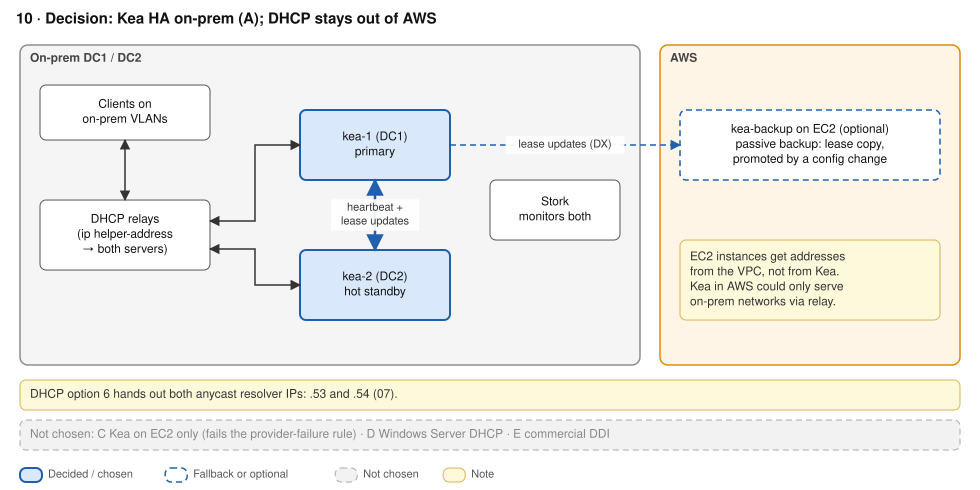

# ADR-04 · DHCP

**Status:** Accepted · **Date:** 2026-09-26 · **Replaces:** old 10

## Context

- **EC2 addressing is AWS-managed.** You can't run DHCP for EC2; VPC DHCP option sets only set things like DNS, domain and NTP. A DHCP server in AWS could only serve on-prem networks through relays across DX.
- DHCP is **stateful** (the lease database). Anycast plus lease state is fragile, so failover must come from the DHCP server's own HA protocol.
- If on-prem DHCP depends on the WAN, **a DX outage stops new on-prem devices from getting an address**: a WAN single point of failure.

## Decision

**ISC Kea HA, hot-standby, anchored on-prem.**
- kea-1 (DC1, primary) and kea-2 (DC2, standby), with the open-source HA and `lease_cmds` hooks. Leases sync on every allocation. Stork monitors both.
- Relays (`ip helper-address`) list **both unicast server IPs**. No anycast.
- DHCP option 6 hands out **both** resolver IPs, `.53` and `.54` ([ADR-02](02-dns.md)).
- **No DHCP in AWS.** An EC2 passive backup (lease copy only, promoted by config change) is optional, if reviewers want an off-site lease copy.

## Options considered

| Option | + | - |
|---|---|---|
| **Kea HA across DC1 and DC2** ✓ | No AWS dependency; survives a DC loss; Kea 3.0 is an LTS; hooks are open source | Doesn't "move to AWS", which has to be argued. Needs a config conversion and a relay change window |
| Kea HA + passive backup on EC2 | Off-site lease copy; AWS stays out of the client path | Manual promotion; UDP 67/68 and the HA API across DX, TGW and security groups |
| Kea on EC2 only, shared SQL lease DB | Managed database; easy to scale | **Fails the provider-failure rule**: any AWS or DX outage stops new leases on-prem |

## Consequences

- `+` On-prem devices still get addresses through an AWS, DX, or single-DC failure.
- `+` Kea replaces fragile anycast DHCP with a failover protocol: a 10-second heartbeat, then partner-down after 60 seconds *and* unanswered clients.
- `-` DHCP does not move to AWS. It serves local L2 segments, and moving it would introduce a WAN single point of failure.
- `-` DHCP scopes and VPC CIDRs must stay non-overlapping; this needs IPAM discipline.

## Well-Architected

REL10-BP01 multiple locations · REL11-BP05 static stability (both partners always running) · REL09-BP01 back up lease data (optional EC2 copy) · REL02-BP05 non-overlapping address ranges · PERF04-BP06 location by network requirements · COST05-BP04 licensing.

## Sources

- [VPC DHCP option sets](https://docs.aws.amazon.com/vpc/latest/userguide/VPC_DHCP_Options.html) · [Moving DHCP to AWS (re:Post)](https://repost.aws/questions/QUFSpQPzpRTz-JxMrx8c4KEA/moving-dhcp-services-to-aws)
- [Kea HA hook](https://github.com/isc-projects/kea/blob/master/doc/sphinx/arm/hooks-ha.rst) · [Kea HA quickstart](https://kb.isc.org/docs/kea-ha-quickstart-guide) · [Kea 3.0 LTS](https://www.isc.org/blogs/kea-3-0/) · [Kea hooks open-sourced](https://www.isc.org/blogs/kea-hooks-opensourced/)
