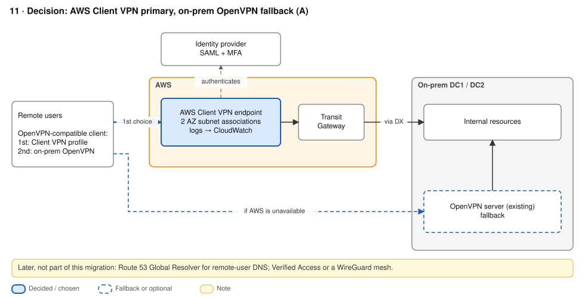

# ADR-05 · Remote access

**Status:** Accepted · **Date:** 2026-09-26 · **Replaces:** old 11

## Context

- VPN sessions are **long-lived and stateful**, so anycast is a poor fit (RFC 7094). Resilience comes from **several endpoints plus client-side failover**.
- An AWS-only VPN can't be the *only* way in: that fails the provider-failure requirement.
- Users should get a new profile, not new software.

## Decision

- **AWS Client VPN** as primary: subnet associations in 2 AZs, SAML with the IdP and MFA, connection logs to CloudWatch. Routes reach on-prem through the TGW and DX.
- The existing **on-prem OpenVPN** stays as the second `remote` in the same client profile. The client fails over on its own if AWS is unreachable.
- **Remote DNS:** Route 53 Global Resolver (managed anycast, DoH/DoT, private hosted zones), with split tunnelling (proposed).
- **Roadmap, not this migration:** AWS Verified Access for web and admin apps, or a WireGuard mesh, to cut back network-level access.

## Options considered

| Option | + | - |
|---|---|---|
| **Client VPN + OpenVPN fallback** ✓ | Managed, per-AZ HA; OpenVPN-compatible; SAML and MFA; survives AWS loss through the fallback | One VPC and one Region per endpoint; client CIDR fixed at creation; ~50 Mbps baseline per connection; cost scales with connected hours |
| Self-managed OpenVPN in AWS and on-prem | Same software as today; keeps the PKI | You patch and scale internet-facing servers; per-server client pools must not overlap |
| AWS Verified Access | Per-app zero trust using identity and device posture; non-HTTP supported | Per-app only; AWS-dependent; new client. A roadmap item |

## Consequences

- `+` Migration is a new client profile, with automatic client-side failover to on-prem.
- `-` Cost example: 200 users × 8 h × 22 days is about 35,200 connection-hours, or **$1,760/month**, plus about $146 for two associations.
- `-` Size the client CIDR once (`/22`–`/12`, about 2× peak users, with no overlap). It cannot be changed later.
- `-` A Region failure moves every user to on-prem OpenVPN, so it must be sized for the full population.

## Well-Architected

SEC02-BP01 strong sign-in · SEC02-BP04 central IdP · SEC04-BP01 logging · REL10-BP01 multiple locations · REL11-BP02 fail over (ordered remotes) · COST07-BP01 pricing model analysis · SUS05-BP03 managed services.

## Sources

- [Client VPN best practices](https://docs.aws.amazon.com/vpn/latest/clientvpn-admin/what-is-best-practices.html) · [Scaling](https://docs.aws.amazon.com/vpn/latest/clientvpn-admin/scaling-considerations.html) · [AWS VPN pricing](https://aws.amazon.com/vpn/pricing/)
- [Verified Access non-HTTP GA](https://aws.amazon.com/blogs/networking-and-content-delivery/aws-verified-access-support-for-non-http-resources-is-now-generally-available) · [Verified Access pricing](https://aws.amazon.com/verified-access/pricing/)
- [Route 53 Global Resolver concepts](https://docs.aws.amazon.com/Route53/latest/DeveloperGuide/gr-concepts-terminology.html) · [OpenVPN Access Server clustering](https://openvpn.net/access-server/features/server-clustering-feature/)
