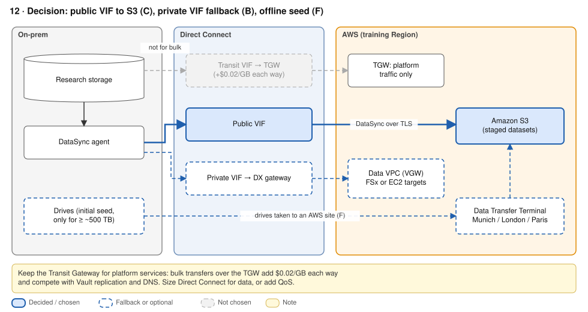
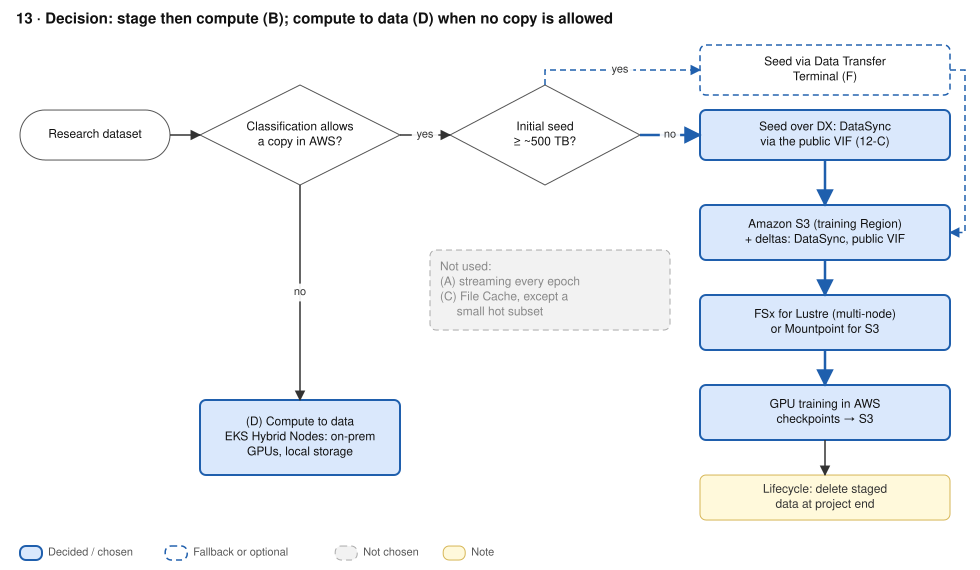

# ADR-06 · Research data path and training locality

**Status:** Accepted · **Date:** 2026-09-26 · **Replaces:** old 12–13

## Context

- Research storage stays on-prem, while GPU compute moves to AWS.
- **DX data in is free; data out is $0.02/GB. The TGW charges $0.02/GB for everything sent into it**, from a VPC *or* from DX. At TB scale that's the biggest per-GB line.
- Training re-reads the dataset **every epoch**, so anything that crosses the WAN per epoch multiplies cost and time.
- Bulk transfers must not starve platform traffic (Vault replication, DNS forwarding).
- Whether a copy may exist in AWS is a **governance question first**, and a cost question second.

Worked example: 50 TB dataset, 20 epochs/month, 2 × 10 Gbps DX (~2 GB/s usable).

## Decision

| # | Question | Decision |
|---|---|---|
| D1 | Network path for bulk data | **Public VIF straight to S3.** Fallback if public VIFs are refused: **private VIF to a dedicated data VPC**. Never through the TGW |
| D2 | Where training reads data | **Stage, then compute:** DataSync to S3, then FSx for Lustre (multi-node) or Mountpoint for S3 (single-node). Datasets that may not be copied: **compute to the data** with EKS Hybrid Nodes |
| D3 | Initial seed | **Over DX** (50 TB ≈ 7 h, ~$625 DataSync). **AWS Data Transfer Terminal** only above ~500 TB (≥ 3 days of saturated DX) |

## Options considered

**D1 · Network path**

| Option | Extra per-GB fee | + | - |
|---|---|---|---|
| **Public VIF → S3** ✓ | None | Cheapest; highest throughput; natural fit for DataSync | Needs public IPs on-prem and filtering of AWS prefixes; security teams may object |
| Private VIF → data VPC | None | Private addressing; isolated from platform traffic | Non-transitive (one VPC); a second routing domain |
| Transit VIF → TGW | **+$0.02/GB each way** | One routing domain | ~$20k/month in TGW fees per PB; competes with platform traffic |

**D2 · Training locality**

| Option | WAN / month | + | - |
|---|---|---|---|
| **Stage then compute** ✓ | 50 TB once + deltas | Epochs run at in-Region speed; ~$1,200/month S3 | A governed copy in AWS (classification, KMS, lifecycle, deletion evidence) |
| Compute to data (EKS Hybrid Nodes) | ~0 | No data movement: strongest governance story | GPU capex; ~$2,800/month Hybrid Nodes fee per 192-vCPU server; needs a reliable link |
| Stream every epoch | 1,000 TB | No copy | ≥ 7 h per epoch; GPUs idle (~$220/h for 4 × p5); starves DX |

A cache (Amazon File Cache, $1.33/GB-month) only makes sense for a small hot subset with an end date.

## Consequences

- `+` Platform services keep the TGW path to themselves; bulk data avoids TGW processing charges.
- `+` Once data is staged, GPU jobs no longer depend on WAN health.
- `-` **Classify each dataset first:** either a copy is allowed (stage it) or it is not (compute next to it).
- `-` Use QoS or separate VIFs so transfers cannot starve Vault replication or DNS forwarding.
- `-` DX is not encrypted by default. Use TLS (S3 and DataSync already do) or MACsec on dedicated ports.
- `-` Drives sent to a Data Transfer Terminal need the same governance approval as the copy itself.

## Well-Architected

COST08-BP01/02/03 data transfer modelling and cost · SUS04-BP07 minimise data movement · MLCOST-21 data and compute proximity (ML Lens) · REL10-BP03 bulkhead (data path separate from service path) · SEC07-BP02 protect data by classification · SEC09-BP02 encryption in transit · Data Residency and Hybrid Cloud Lens: classify data.

## Sources

- [Optimizing S3 transfers over Direct Connect (AWS blog)](https://aws.amazon.com/blogs/networking-and-content-delivery/optimizing-amazon-s3-data-transfers-over-direct-connect/) · [DX pricing](https://aws.amazon.com/directconnect/pricing/) · [TGW pricing](https://aws.amazon.com/transit-gateway/pricing/) · [DataSync pricing](https://aws.amazon.com/datasync/pricing/)
- [ML Lens MLCOST-21](https://docs.aws.amazon.com/wellarchitected/latest/machine-learning-lens/mlcost-21.html) · [EKS AI/ML storage best practices](https://docs.aws.amazon.com/eks/latest/best-practices/aiml-storage.html) · [EKS Hybrid Nodes](https://docs.aws.amazon.com/eks/latest/userguide/hybrid-nodes-overview.html)
- [File Cache pricing](https://aws.amazon.com/filecache/pricing/) · [Snowball Edge availability change](https://docs.aws.amazon.com/snowball/latest/developer-guide/snowball-edge-availability-change.html) · `data-locality-costs.md` (project, worked numbers)
