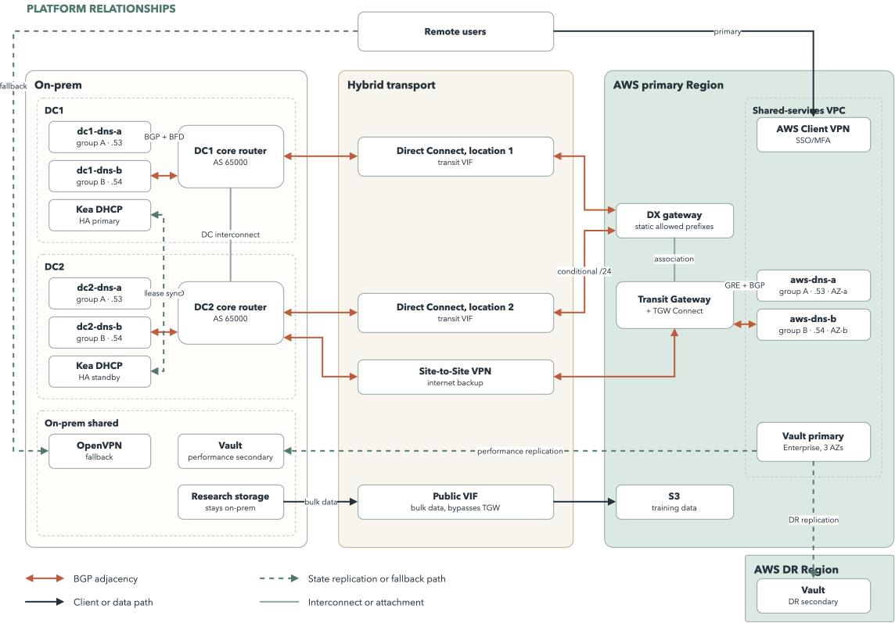
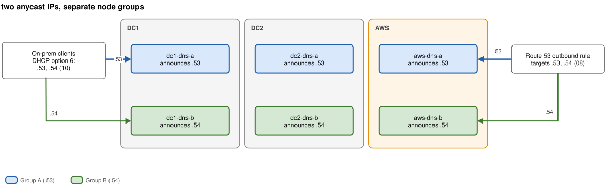

# Overview

## Scope

In order to keep services reachable, even in the case of a provider loss or Datacenter (DC) going down, we will build a robust networking infrastructure. The core assumption is that the AWS Cloud is preferred, but On-prem data services will still live on in their current state.
Single points of failure will be avoided and the AWS Well-Architected framework will be use as a quality check, with a focus on the [Hybrid Networking Lens](https://docs.aws.amazon.com/wellarchitected/latest/hybrid-networking-lens/hybrid-networking-lens.html)

## Assumptions
- There are 2 Zones in the on prem data center
- There are 2 AWS Regions used for redundancy (1 primary, one for disaster recovery)
- Since research data remains on prem, there is no hard requirement to transmit large volumes of data over the Transit Gateway on a regular basis
- DeepL owns an ASN and it's address block. On prem routers already run BGP
- Everything is deployed and managed using IaC and must be version controlled

## Topology Bird's eye view
- **Connectivity** - Direct Connect will provide the private connection between the sites. We use GRE tunnels and BGP propagation in this manner. We will use VPN as a site to site backup. 
- **Service Name Resolution** - We define 2 DNS resolver groups with 3 members each. One member of each group (2 in total) present per location (DC1, DC2, AWS main region). They will use anycast. Group A will be associated with `.53` and Group B with `.54`.
- **DHCP** -  DHCP leases are only relevant on prem and thus we will use 2 Kea servers will be used, one for each DC, in stand-by. EC2 instances get their own IP from DHCP. Optionally we can have an off-site Kea replica in AWS.
- **Vault** - We will be using vault enterprise with a 5 node split across 3 availability zones, with a read replica on prem and a DR copy in a different AWS region
- **VPN** - AWS Client VPN will be used with a fallback to on-prem, in case of AWS downtime

# Service Design

## Recursive DNS
### Placement
- In each one of the locations we will have 2 nodes. One for each one of the 2 groups. Group A will answer on `.53` and group B will answer on `.54`.
- We will run PowerDNS Recursor on one group and potentially Unbound on another, thus breaking one system will not break the other.
- On prem clients will get both IPs, through DHCP. the Cloud base workloads will use the VPC Resolver. Thse will forward 

### High Availability
- Potential breaking changes on Group A would not impact Group B, which improves reliability and confidence in pushing changes (software diversity)
- AWS and On-prem each resolve their own addresses. In case of an outage, only the cross-site endpoints would be affected
- Clients shall not wait for a broken node: Each node withdraws within 5 second if the resolver stops answering on said node

### Failure behaviour

## Vault
### Placement
- Across 3 AZs in one Region, we will have 5 nodes
- Performance will be improved on prem by using a read replica. This shall be unsealed locally (HSM? Shamir?)
- We will use a secondary disaster recovery copy in a separate AWS region
- In this case we will use a load balancer in each site. Vault does not get an anycast address

### High Availability
- A 5 node setup means that even when losing an AZ we will still have a quorum
- In the case AWS becomes unavailable, the on-prem replica would still be reachable in order to provide access to secrets and issue tokens as needed. It can still be unsealed because it does not depend on AWS KMS

### Failure behaviour

## DHCP

### Placement
- On prem only. In AWS IPs get allocated automatically
- One Kea server will be present in each DC
- **Optional**: add a passive copy in AWS so that the leases can be saved in case of loss

### High Availability
- Point to both servers (without anycast)
- On every allocation we want to sync the leases to the standby
- Here we are not dependent on anything in AWS 

### Failure behaviour

## Remote Access
### Placement
- Using managed service as primary entry point.
- The current solution will be used as fallback
### High Availability
- Fall back to on-prem setup in case this becomes unavailable
- Both endpoints will be made available in the same client profile. Changes will be user agnostic
### Failure behaviour

# Notes
- this design introduces Operational complexity in order to address the requirement of a "provider going down". In reality, AWS route53 has [an outstanding SLA](https://aws.amazon.com/route53/sla/). In practical terms, even during the famous 2025 [control plane incident](https://www.techupkeep.dev/blog/aws-outage-october-2025-analysis) query requests could still be served.
- based on the previous note, the Vault implementation is also adding a read replica on-prem. If the strategy is to become Cloud Native, then using AWS Secrets Manager ([99.99% SLA](https://aws.amazon.com/secrets-manager/sla/)), AWS PCA ([99.9% SLA](https://aws.amazon.com/private-ca/sla/)) and AWS IAM Roles Anywhere (no specific SLA, but core to AWS itself) would be preferred. The high up front cost in migrating would very likely be offset by gains in maintainence efficiency.